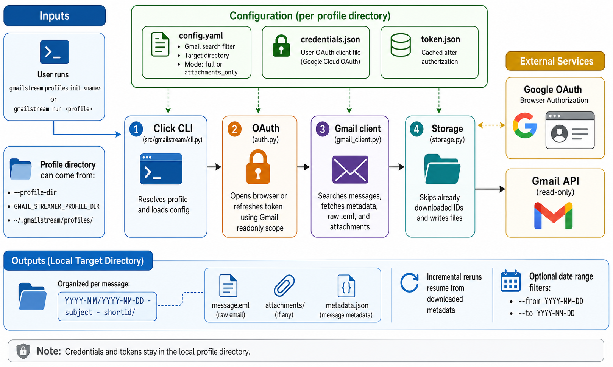

<div align="center">
  

  **📧 Download Gmail messages matching your filters to local files 📥**
</div>

gmailstream is a Python CLI for downloading Gmail messages through OAuth2. It uses named profiles so each export can keep its own Gmail search query, credentials, mode, and target directory.

Use it to archive full `.eml` messages or save attachments from messages matched by Gmail search filters such as `from:`, `has:attachment`, `after:`, labels, and other Gmail query syntax.

## Install

```bash
git clone https://github.com/tsilva/gmailstream.git
cd gmailstream
uv tool install . --force --no-cache
```

Create and authorize a profile, then run it:

```bash
gmailstream profiles init my-profile
gmailstream run my-profile
```

The init flow prompts for a Gmail filter, output directory, download mode, and a Google OAuth `credentials.json` file. See [Creating OAuth Credentials](docs/credentials-guide.md) for the Google Cloud setup.

## Commands

```bash
uv sync                                           # install development dependencies
uv tool install . --force --no-cache              # install the CLI from this checkout
gmailstream run <profile>                         # download new matching messages
gmailstream run <profile> --from 2024-01-01       # limit by start date
gmailstream run <profile> --to 2024-12-31         # limit by end date
gmailstream --verbose run <profile>               # enable debug logging
gmailstream --profile-dir /path run <profile>     # use a custom profiles directory
gmailstream profiles list                         # list profiles
gmailstream profiles init <name>                  # create and authenticate a profile
gmailstream profiles show <name>                  # print profile config
```

## Notes

- Requires Python 3.12+ and `uv`.
- Profiles live in `~/.gmailstream/profiles/` by default. Override this with `--profile-dir` or `GMAIL_STREAMER_PROFILE_DIR`.
- A profile can also be passed as a direct path to an existing profile directory.
- Each profile contains `config.yaml`, user-supplied `credentials.json`, and auto-generated `token.json`.
- `mode: full` saves `message.eml`, attachments, and `metadata.json`. `mode: attachments_only` saves attachments plus `metadata.json`.
- Downloads are organized under the target directory as `YYYY-MM/YYYY-MM-DD - subject - shortid/`.
- Runs are incremental by default. Explicit `--from` or `--to` date ranges search that date range and skip files already present there.
- `credentials.json` and `token.json` are sensitive local files and are ignored by git.

## Architecture



## License

[MIT](LICENSE)
